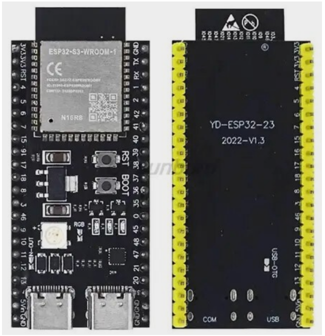
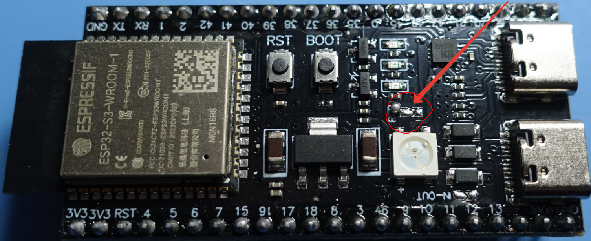

# getting started

https://docs.espressif.com/projects/esp-dev-kits/en/latest/esp32s3/esp32-s3-devkitc-1/user_guide.html#getting-started

# extension for vsc
https://github.com/espressif/vscode-esp-idf-extension

# permision for usb

`sudo chmod 666 /dev/ttyACM0`

# RGB-LED not working

EGB-LED works on GPIO48.

But it could be disabled (on replica for example YD-ESP32-23 2022-V1.3)

In case LED is not working check the `RGB` jumper on a board.

